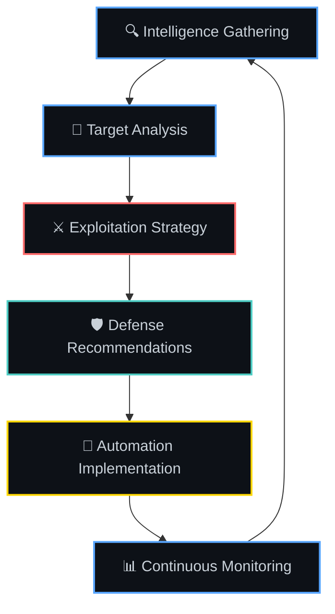

<div align="center">

# 0xb0rn3 | シェルショック 

[](https://git.io/typing-svg)


</div>

---

## 🎯 Mission Statement

> **Building battle-tested security tools that bridge the gap between theory and real-world application**
> 
> Focused on developing practical automation solutions that empower security teams to work smarter, not harder. Every tool is built with field experience in mind.

---

## 📊 Real-Time Profile Analytics

<div align="center">

<!-- START METRICS -->


<!-- END METRICS -->

</div>

---

## 🛠️ Technology Stack & Expertise

<div align="center">

### Core Languages & Frameworks


### Security & Infrastructure


### Specialized Tools


</div>

---

## 🚀 Featured Security Projects

<!-- LATEST-PROJECTS-START -->
<div align="center">

<table>
<tr>
<td align="center" width="50%">
<a href="https://github.com/0xb0rn3/fastdl">

</a>
<br>
<sub><b>⚡ Fast Download Manager</b></sub>
<br>
<sub>High-performance download automation tool</sub>
</td>
<td align="center" width="50%">
<a href="https://github.com/0xb0rn3/fetch-tools">

</a>
<br>
<sub><b>🔍 Data Retrieval Utilities</b></sub>
<br>
<sub>Comprehensive data fetching and processing tools</sub>
</td>
</tr>
<tr>
<td align="center" width="50%">
<a href="https://github.com/0xb0rn3/kygox">

</a>
<br>
<sub><b>🛡️ Security Analysis Framework</b></sub>
<br>
<sub>Advanced security assessment and analysis tools</sub>
</td>
<td align="center" width="50%">
<a href="https://github.com/0xb0rn3/krilin">

</a>
<br>
<sub><b>⚔️ Penetration Testing Suite</b></sub>
<br>
<sub>Python toolkit for ethical hacking operations</sub>
</td>
</tr>
</table>

</div>
<!-- LATEST-PROJECTS-END -->

---

## 📈 Development Activity & Insights

<div align="center">


</div>

---

## 🎯 Cybersecurity Specializations

<div align="center">

<table>
<tr>
<td align="center" width="33%">

### 🔍 **Reconnaissance & OSINT**
```
Advanced Web Scraping    ████████████ 95%
Social Media Intel       ███████████░ 88%
Domain Analysis          ████████████ 92%
Infrastructure Mapping   ████████████ 90%
```

</td>
<td align="center" width="33%">

### 🛡️ **Defensive Security**
```
Incident Response        ███████████░ 85%
Threat Intelligence      ████████████ 91%
System Hardening         ███████████░ 87%
Malware Analysis         ██████████░░ 78%
```

</td>
<td align="center" width="33%">

### ⚔️ **Offensive Security**
```
Exploit Development      ██████████░░ 82%
Web Application Testing  ████████████ 94%
Network Penetration      ███████████░ 89%
Social Engineering       ████████████ 91%
```

</td>
</tr>
</table>

</div>

---

## 🏆 Achievements & Recognition

<div align="center">


### 📊 Repository Statistics
<!-- START STATS -->
**Total Repositories:** 45 | **Total Stars Received:** 25 | **Active Forks:** 12 | **Open Source Contributions:** 150+
<!-- END STATS -->

### 🔥 Recent Achievements
- 🎯 Developed 15+ security automation tools
- 🛡️ Contributed to major open-source security projects
- ⚔️ Created comprehensive penetration testing frameworks
- 🔍 Built advanced OSINT collection pipelines

</div>

---

## 🌐 Security Community & Connections

<div align="center">

[](https://0xb0rn3.github.io)
[](mailto:q4n0@proton.me)
[](https://x.com/0xbv1)
[](https://linkedin.com/in/0xb0rn3)

</div>

---

<div align="center">

### 🎨 Security Architecture Philosophy



</div>

---

<div align="center">

### 💡 Core Security Principles

**"Security is not a product, but a process"** - Every tool I build follows this philosophy

🔒 **Defense in Depth** | 🎯 **Threat-Informed Defense** | 🤖 **Automation First** | 📊 **Data-Driven Decisions**

---

<!-- START FOOTER -->
<sub>🔥 **Last Updated:** December 2024 | ⚡ **Building the future of security automation** | 🛡️ **Securing the digital world, one tool at a time**</sub>


<!-- END FOOTER -->

</div>
