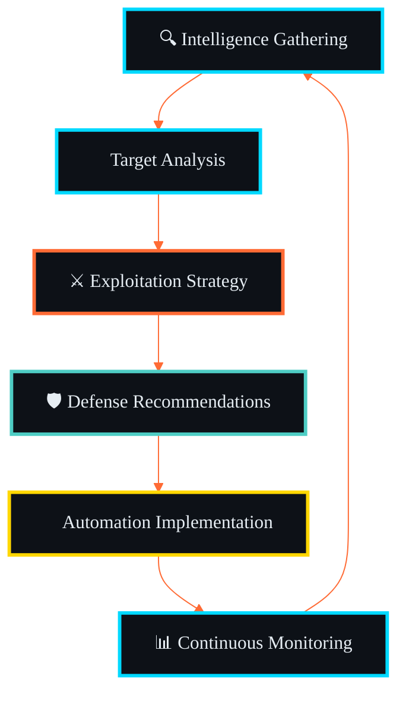

<div align="center">

<!-- Animated Header with Gradient -->


<!-- Dynamic Typing Animation -->
<a href="https://git.io/typing-svg">
  
</a>

<br>

<!-- Glowing Divider -->


</div>

<!-- Mission Control Section with ASCII Art -->
<div align="center">

##  MISSION CONTROL 


<!-- Neon Divider -->


<!-- Real-Time Metrics Dashboard -->
<div align="center">

##  REAL-TIME INTELLIGENCE DASHBOARD 

<table>
<tr>
<td align="center" width="50%">
<a href="#"></a>
</td>
<td align="center" width="50%">
<a href="#"></a>
</td>
</tr>
</table>

<table>
<tr>
<td align="center" width="50%">
<a href="#"></a>
</td>
<td align="center" width="50%">
<a href="#"></a>
</td>
</tr>
</table>

</div>

<br>

<!-- Animated Divider -->


<!-- Technology Stack Section -->
<div align="center">

##  TECHNOLOGY ARSENAL 

###  Core Languages & Frameworks

<table align="center">
<tr>
<td align="center" width="100">
<a href="#"></a>
<br><sub><b>Python</b></sub>
</td>
<td align="center" width="100">
<a href="#"></a>
<br><sub><b>Go</b></sub>
</td>
<td align="center" width="100">
<a href="#"></a>
<br><sub><b>Rust</b></sub>
</td>
<td align="center" width="100">
<a href="#"></a>
<br><sub><b>Bash</b></sub>
</td>
<td align="center" width="100">
<a href="#"></a>
<br><sub><b>C/C++</b></sub>
</td>
<td align="center" width="100">
<a href="#"></a>
<br><sub><b>JavaScript</b></sub>
</td>
</tr>
</table>

###  Security & DevOps Infrastructure

<table align="center">
<tr>
<td align="center" width="100">
<a href="#"></a>
<br><sub><b>Docker</b></sub>
</td>
<td align="center" width="100">
<a href="#"></a>
<br><sub><b>Kubernetes</b></sub>
</td>
<td align="center" width="100">
<a href="#"></a>
<br><sub><b>AWS</b></sub>
</td>
<td align="center" width="100">
<a href="#"></a>
<br><sub><b>GitHub</b></sub>
</td>
<td align="center" width="100">
<a href="#"></a>
<br><sub><b>Linux</b></sub>
</td>
<td align="center" width="100">
<a href="#"></a>
<br><sub><b>Nginx</b></sub>
</td>
</tr>
</table>

###  Elite Security Tools

<table align="center">
<tr>
<td align="center" width="140">
<a href="#"></a>
<br><sub><b>Kali Linux</b></sub>
</td>
<td align="center" width="140">
<a href="#"></a>
<br><sub><b>Metasploit</b></sub>
</td>
<td align="center" width="140">
<a href="#"></a>
<br><sub><b>Wireshark</b></sub>
</td>
<td align="center" width="140">
<a href="#"></a>
<br><sub><b>Burp Suite</b></sub>
</td>
<td align="center" width="140">
<a href="#"></a>
<br><sub><b>Nmap</b></sub>
</td>
</tr>
</table>

</div>

<br>

<!-- Glowing Divider -->


<!-- Featured Projects Section -->
<div align="center">

##  FEATURED ARSENAL 

<table>
<tr>
<td width="50%" valign="top">

###  Active Operations

<div align="center">

<a href="https://github.com/0xb0rn3/fastdl">
  
</a>

<br><br>

<a href="https://github.com/0xb0rn3/fetch-tools">
  
</a>

</div>

</td>
<td width="50%" valign="top">

###  Offensive Tools

<div align="center">

<a href="https://github.com/0xb0rn3/kygox">
  
</a>

<br><br>

<a href="https://github.com/0xb0rn3/krilin">
  
</a>

</div>

</td>
</tr>
</table>

</div>

<br>

<!-- Neon Divider -->


<!-- Development Activity Section -->
<div align="center">

##  OPERATIONAL TIMELINE 

<a href="#"></a>

<br>

<a href="#"></a>

</div>

<br>

<!-- Animated Divider -->


<!-- Expertise Matrix Section -->
<div align="center">

##  EXPERTISE MATRIX 

</div>

<table>
<tr>
<td width="33%" valign="top">

<div align="center">

###  Reconnaissance

</div>

```javascript
const recon = {
  webScraping:    '██████████ 95%',
  socialIntel:    '█████████░ 88%',
  domainAnalysis: '██████████ 92%',
  infraMapping:   '█████████░ 90%',
  darkWebOSINT:   '████████░░ 85%',
  threatHunting:  '█████████░ 87%'
}
```

<div align="center">

</div>

</td>
<td width="33%" valign="top">

<div align="center">

###  Defense

</div>

```javascript
const defense = {
  incidentResponse: '█████████░ 85%',
  threatIntel:      '██████████ 91%',
  systemHardening:  '█████████░ 87%',
  malwareAnalysis:  '████████░░ 78%',
  forensics:        '█████████░ 86%',
  SIEM_Mastery:     '████████░░ 83%'
}
```

<div align="center">

</div>

</td>
<td width="33%" valign="top">

<div align="center">

###  Offense

</div>

```javascript
const offense = {
  exploitDev:     '████████░░ 82%',
  webAppTesting:  '██████████ 94%',
  networkPentest: '█████████░ 89%',
  socialEng:      '██████████ 91%',
  redTeamOps:     '█████████░ 88%',
  zeroDay:        '████████░░ 80%'
}
```

<div align="center">

</div>

</td>
</tr>
</table>

<br>

<!-- Glowing Divider -->


<!-- Achievements Section -->
<div align="center">

##  ACHIEVEMENTS & RECOGNITION 

<a href="#"></a>

###  Impact Metrics

<table>
<tr>
<td align="center">

</td>
<td align="center">

</td>
<td align="center">

</td>
<td align="center">

</td>
</tr>
</table>

###  Recent Operations

<table>
<tr>
<td>

- 🎯 **Developed 15+ Security Automation Tools**
- 🛡️ **Major Open-Source Security Contributions**
- ⚔️ **Built Comprehensive Pentest Frameworks**

</td>
<td>

- 🔍 **Advanced OSINT Collection Pipelines**
- 🤖 **Automated Threat Detection Systems**
- 🌐 **Active Security Community Engagement**

</td>
</tr>
</table>

</div>

<br>

<!-- Neon Divider -->


<!-- Security Philosophy Section -->
<div align="center">

##  SECURITY ARCHITECTURE PHILOSOPHY 

</div>



<br>

<!-- Core Principles -->
<div align="center">

###  Core Security Principles

</div>

<table>
<tr>
<td align="center" width="25%">

<br><b>Defense in Depth</b>
<br><sub>Multi-layered security architecture</sub>
</td>
<td align="center" width="25%">

<br><b>Threat-Informed</b>
<br><sub>Intelligence-driven defense</sub>
</td>
<td align="center" width="25%">

<br><b>Automation First</b>
<br><sub>Efficiency through automation</sub>
</td>
<td align="center" width="25%">

<br><b>Data-Driven</b>
<br><sub>Evidence-based decisions</sub>
</td>
</tr>
</table>

<br>

<div align="center">

### 💭 Philosophy


</div>

<br>

<!-- Animated Divider -->


<!-- Connect Section -->
<div align="center">

##  SECURE COMMUNICATIONS 

<table>
<tr>
<td align="center">
<a href="https://0xb0rn3.github.io">

</a>
</td>
<td align="center">
<a href="mailto:q4n0@proton.me">

</a>
</td>
<td align="center">
<a href="https://x.com/0xbv1">

</a>
</td>
<td align="center">
<a href="https://linkedin.com/in/0xb0rn3">

</a>
</td>
</tr>
</table>

</div>

<br>

<!-- Snake Animation -->
<div align="center">

<picture>
  <source media="(prefers-color-scheme: dark)" srcset="https://raw.githubusercontent.com/0xb0rn3/0xb0rn3/output/github-contribution-grid-snake-dark.svg">
  <source media="(prefers-color-scheme: light)" srcset="https://raw.githubusercontent.com/0xb0rn3/0xb0rn3/output/github-contribution-grid-snake.svg">
  
</picture>

</div>

<br>

<!-- Footer -->
<div align="center">


<table>
<tr>
<td align="center">

</td>
<td align="center">

</td>
<td align="center">

</td>
</tr>
</table>

<br>

###  Last Updated: December 2024

<sub>🔥 Building the future of security automation | ⚡ Securing the digital world, one tool at a time | 🛡️ Always ready, always vigilant</sub>

</div>

<br>

<!-- Animated Footer Wave -->


</div>
