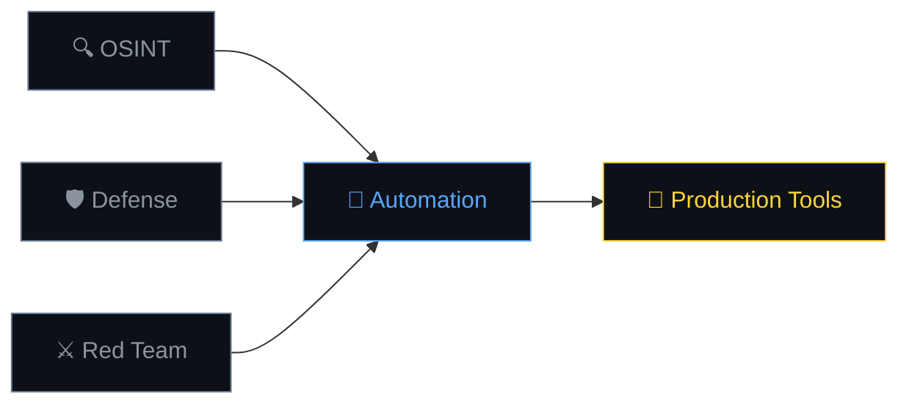

<div align="center">

# 0xb0rn3

[](https://git.io/typing-svg)

<br>

<div align="center">
  
  
</div>

</div>

---

## 🎯 What I Do

Building security tools that solve real problems. No fluff, just practical automation that makes security teams more effective.

<div align="center">

```ascii
┌─────────────────────────────────────────────────────────────┐
│  🔍 OSINT Tools     │  🛡️  Defense Auto   │  ⚔️  Red Team     │
│  ├─ Reconnaissance  │  ├─ Threat Intel    │  ├─ Payload Gen   │
│  ├─ Data Mining     │  ├─ Incident Resp   │  ├─ Exploit Dev    │
│  └─ Target Profiling│  └─ System Hardening│  └─ Post-Exploit  │
└─────────────────────────────────────────────────────────────┘
```

</div>

---

## 🛠️ Tech Stack

<div align="center">

### Languages & Frameworks


### Infrastructure


### Security Tools


</div>

---

## 🚀 Current Projects

<div align="center">

<table>
<tr>
<td align="center" width="50%">
<a href="https://github.com/0xb0rn3/r3cond0g">

</a>
<br>
<code>Advanced Recon Automation</code>
</td>
<td align="center" width="50%">
<a href="https://github.com/0xb0rn3/krilin">

</a>
<br>
<code>Threat Intelligence Platform</code>
</td>
</tr>
</table>

</div>

---

## 📊 Activity & Performance

<div align="center">


</div>

<div align="center">

### Current Focus Areas



</div>

---

## 🎯 Skills Breakdown

<div align="center">

<table>
<tr>
<td valign="top" width="33%">

### 🔍 **Reconnaissance**
```
Web Scraping      ████████████ 95%
OSINT Analysis    ███████████░ 90%
Social Engineering███████████░ 85%
DNS Enumeration   ████████████ 92%
```

</td>
<td valign="top" width="33%">

### 🛡️ **Defense**
```
Incident Response ███████████░ 88%
Threat Hunting    ████████████ 90%
System Hardening ███████████░ 87%
Malware Analysis  ██████████░░ 82%
```

</td>
<td valign="top" width="33%">

### ⚔️ **Offensive**
```
Exploit Development██████████░░ 85%
Post-Exploitation ███████████░ 88%
Web App Testing   ████████████ 93%
Network Pentesting███████████░ 89%
```

</td>
</tr>
</table>

</div>

---

## 🌐 Connect & Collaborate

<div align="center">

[](https://0xb0rn3.github.io)
[](mailto:q4n0@proton.me)
[](https://x.com/0xbv1)
[](https://github.com/0xb0rn3)

</div>

---

<div align="center">

### 🔥 Latest Achievement


---

<sub>⚡ **Building security tools that actually work in the real world**</sub>

</div>
