<!-- Clean Header -->

 

<!-- Animated Typing Effect -->

  

<!-- Profile Image with Animation -->

 

---

## About

> **I design and develop cybersecurity solutions that merge technical depth with practical impact — focused on automation, precision, and real-world execution.**

 

<!-- Animated Status Badges -->

---

 

<!-- Stats Section -->

## 📊 GitHub Metrics

<table>
<tr>
<td align="center" width="50%">

</td>
<td align="center" width="50%">

</td>
</tr>
</table>

<table>
<tr>
<td align="center" width="50%">

</td>
<td align="center" width="50%">

</td>
</tr>
</table>

<!-- Animated Wave Stats -->
 

 

---

 

<!-- Technology Stack -->

## 🛠️ Technology Stack

### Core Languages

<table>
<tr>
<td align="center" width="96">

 Python
</td>
<td align="center" width="96">

 Go
</td>
<td align="center" width="96">

 Rust
</td>
<td align="center" width="96">

 Bash
</td>
<td align="center" width="96">

 C/C++
</td>
<td align="center" width="96">

 JavaScript
</td>
</tr>
</table>

### Infrastructure & DevOps

<table>
<tr>
<td align="center" width="96">

 Docker
</td>
<td align="center" width="96">

 Kubernetes
</td>
<td align="center" width="96">

 AWS
</td>
<td align="center" width="96">

 Linux
</td>
<td align="center" width="96">

 GitHub
</td>
<td align="center" width="96">

 Nginx
</td>
</tr>
</table>

 

---

 

<!-- Featured Projects -->

## 🚀 Featured Projects

<table>
<tr>
<td width="50%">

<h3 align="center">Security Automation</h3>

  

</td>
<td width="50%">

<h3 align="center">Offensive Tools</h3>

  

</td>
</tr>
</table>

 

---

 

<!-- Expertise -->

## 💼 Expertise

<table>
<tr>
<td width="33%" valign="top">

<h3 align="center">🔍 Reconnaissance & OSINT</h3>

**Web Scraping** • **Social Intelligence**  
**Domain Analysis** • **Infrastructure Mapping**  
**Dark Web OSINT** • **Threat Hunting**

 

</td>
<td width="33%" valign="top">

<h3 align="center">🛡️ Defensive Security</h3>

**Incident Response** • **Threat Intelligence**  
**System Hardening** • **Malware Analysis**  
**Digital Forensics** • **SIEM Operations**

 

</td>
<td width="33%" valign="top">

<h3 align="center">⚔️ Offensive Security</h3>

**Exploit Development** • **Web App Testing**  
**Network Penetration** • **Social Engineering**  
**Red Team Operations** • **Zero-Day Research**

 

</td>
</tr>
</table>

 

---

 

<!-- Impact Metrics -->

## 🏆 Impact Metrics

<table>
<tr>
<td align="center">

</td>
<td align="center">

</td>
<td align="center">

</td>
<td align="center">

</td>
</tr>
</table>

 

<!-- Animated Trophies -->

 

<!-- Live Contribution Stats -->

 

---

 

<!-- Security Philosophy -->

## 🎯 Security Philosophy

```mermaid
%%{init: {'theme':'base', 'themeVariables': { 'primaryColor':'#000000', 'primaryTextColor':'#ffffff', 'primaryBorderColor':'#ffffff', 'lineColor':'#ffffff', 'secondaryColor':'#0a0a0a', 'tertiaryColor':'#1a1a1a', 'background':'#000000', 'mainBkg':'#000000', 'secondBkg':'#0a0a0a'}}}%%
graph LR
    A[Intelligence Gathering] --> B[Target Analysis]
    B --> C[Exploitation Strategy]
    C --> D[Defense Recommendations]
    D --> E[Automation Implementation]
    E --> F[Continuous Monitoring]
    F --> A
    
    style A fill:#000,stroke:#fff,stroke-width:2px,color:#fff
    style B fill:#000,stroke:#fff,stroke-width:2px,color:#fff
    style C fill:#000,stroke:#fff,stroke-width:2px,color:#fff
    style D fill:#000,stroke:#fff,stroke-width:2px,color:#fff
    style E fill:#000,stroke:#fff,stroke-width:2px,color:#fff
    style F fill:#000,stroke:#fff,stroke-width:2px,color:#fff
```

 

### Core Principles

<table>
<tr>
<td align="center" width="25%">
 
<b>Defense in Depth</b>
 
Multi-layered security
  
</td>
<td align="center" width="25%">
 
<b>Threat-Informed</b>
 
Intelligence-driven defense
  
</td>
<td align="center" width="25%">
 
<b>Automation First</b>
 
Efficiency through code
  
</td>
<td align="center" width="25%">
 
<b>Data-Driven</b>
 
Evidence-based decisions
  
</td>
</tr>
</table>

 

> *"Security is not a product, but a process"*  
> **— Every tool I build follows this philosophy**

 

---

 

<!-- Animated Contribution Graph -->

<picture>
  <source media="(prefers-color-scheme: dark)" srcset="https://raw.githubusercontent.com/0xb0rn3/0xb0rn3/output/github-contribution-grid-snake-dark.svg">
  <source media="(prefers-color-scheme: light)" srcset="https://raw.githubusercontent.com/0xb0rn3/0xb0rn3/output/github-contribution-grid-snake.svg">
  
</picture>

 

---

 

<!-- Connect -->

## 🌐 Connect

<table>
<tr>
<td align="center">

</td>
<td align="center">

</td>
<td align="center">

</td>
<td align="center">

</td>
</tr>
</table>

 

<table>
<tr>
<td align="center">

</td>
<td align="center">

</td>
<td align="center">

</td>
<td align="center">

</td>
</tr>
</table>

<!-- Animated GitHub Skyline -->
 

 

---

Building the future of security automation • One tool at a time

  

<!-- Clean Footer -->

